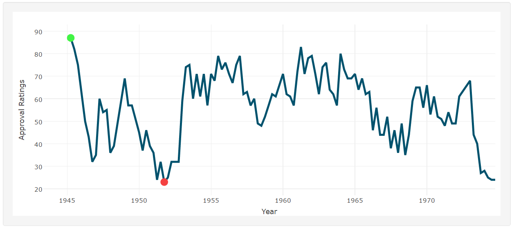

Approval Ratings of US Presidents (1945 ~ 1975)
========================================================
author: JH
date: April 16, 2017
autosize: true

Background
========================================================

An approval rating is a percentage determined by a polling which indicates the percentage of respondents to an opinion poll who approve of a particular person or program.

In the United States, presidential job approval ratings were introduced by George Gallup in the late 1930s (probably 1937) to gauge public support for the President of the United States during his term.

This Shiny App is created to analyze the approval ratings within 30 years after World War II.

Data Source
========================================================
The raw data is from the R Datasets Package. 


```r
library(zoo)
presidents <- get("presidents", "package:datasets")
presidents.df <- data.frame(rating=as.matrix(presidents), date=as.Date(time(presidents)))
```

The average of all ratings is :  


```
[1] "Ovarall Average Rating = 56.31"
```

Select Date Range
========================================================


***
The app use a sliderInput to allow a user to select a date range for analysis.  If the selected range does not return any data, a friendly message will show to ask the user to pick another date range.

Plotly plot
========================================================
The Shiny server will automatically show the rating trace for the given range in a Plotly plot, the min and max are also marked.


